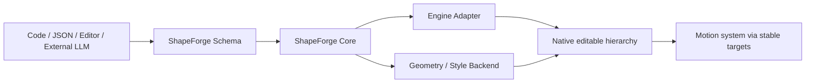

# ShapeForge

[](https://github.com/TristinOrg/ShapeForge/actions/workflows/repository-validation.yml)
[](https://unity.com/releases/editor/whats-new/2022.3.62)
[](https://github.com/TristinOrg/ShapeForge/releases/tag/v0.1.0)
[](LICENSE.md)

ShapeForge is an engine-agnostic, schema-driven procedural 3D generation framework. It describes models as meaningful shapes, styles, and editable hierarchies that can be authored in code, serialized as JSON, generated by external LLMs, and adapted to a game engine.

See [ROADMAP.md](ROADMAP.md) for architecture and continuation instructions, and the public [ShapeForge Roadmap Project](https://github.com/orgs/TristinOrg/projects/1) for milestone status and Issues.

The project starts with Unity and an official Low Poly implementation, but neither Unity nor Low Poly defines the framework boundary. A future Godot or Unreal adapter can consume the same concepts by implementing its own engine and geometry backends.

ShapeForge is designed for developers who need usable game models without requiring a traditional modeling workflow for every prop, character, building, vehicle, or environment blockout.

## Release status

Version `0.1.0` is the first framework release. It establishes the public package boundaries, Shape and Style JSON contracts, Unity adapter, Low Poly geometry backend, semantic rig boundary, runtime generation pipeline, performance safeguards, and representative presets.

ShapeForge is suitable for experimentation, tooling integrations, procedural content pipelines, prototypes, and stylized production assets whose geometry can be expressed as semantic parts. The API remains pre-1.0 and may evolve based on real project feedback.

## Core ideas

- **Shape is the smallest modeling concept.** Cubes, capsules, profiles, sweeps, cages, and future custom types use the same extensible node contract.
- **Models are editable assemblies.** Stable IDs and nested transforms produce a native hierarchy instead of an opaque combined mesh.
- **Style is separate from geometry.** Palette roles and inherited styles allow the same definition to be rendered with different visual treatments.
- **External AI is an author, not a dependency.** LLMs produce validated ShapeForge JSON; no AI provider is referenced by Schema or Core.
- **Motion is a separate responsibility.** ShapeForge exposes semantic pivots and transform targets so MotionForge or another animation system can bind without owning model generation.
- **Low Poly is an implementation.** Developers can add realistic, voxel, SDF, custom-mesh, or engine-specific generators without changing Core.
- **Performance is explicit.** Meshes and materials are cached, repeated definitions can be prepared once, and large batches remain caller-budgeted.

## Deterministic reference preprocessing

Reference images can be converted into an engine-neutral blueprint before any model is authored:

```powershell
python tools/shapeforge.py reference-blueprint "reference.png" `
  -o "Library/ShapeForgeBlueprints/asset/reference-blueprint.json" `
  --crops "Library/ShapeForgeBlueprints/asset/views"
```

The same command accepts a character sheet, building, prop, vehicle, or other visual asset. It extracts reproducible view crops, normalized bounds, silhouettes, proportions, palette samples, and confidence values. It intentionally leaves category, semantic part names, hidden geometry, scale, and orientation unresolved instead of guessing.

Only entries in `reviewQueue` require interpretation by a person or optional AI. A category-specific compiler can then translate the reviewed blueprint into a ShapeForge construction plan; Schema and Core remain category-, style-, engine-, and AI-provider-neutral.

Run the resumable workflow instead when preparing an asset for later compilation:

```powershell
python tools/shapeforge.py reference-pipeline "reference.png" --work "Library/ShapeForgeReference/asset"
```

This writes `pipeline.json`, measured view crops, `reference-blueprint.json`, and `review-template.json`. The first pass returns `awaiting-review`. Fill only the unresolved decisions, preserving whether each answer came from `human`, `ai`, or `deterministic` analysis, then resume:

```powershell
python tools/shapeforge.py reference-pipeline "reference.png" `
  --work "Library/ShapeForgeReference/asset" `
  --review "Library/ShapeForgeReference/asset/completed-review.json"
```

A complete review produces `reviewed-blueprint.json` and the explicit `ready-for-compiler` handoff. No geometry is generated by preprocessing, and character, building, vehicle, and prop compilers remain replaceable downstream consumers.

For dense reference sheets, the grid profile additionally preserves top/bottom views, local detail crops, measurement diagrams, text regions, and labeled swatches. Supply OCR or deterministic transcription through `--annotations annotations.json`; explicit `#RRGGBB` labels and written measurements override pixel estimates while retaining source and confidence. This keeps OCR replaceable and prevents Core from depending on a vision or AI provider.

## Architecture



The repository contains four Unity Package Manager packages:

| Package | Responsibility |
|---|---|
| `com.shapeforge.schema` | Serializable, engine-neutral shape, style, reference, and rig contracts |
| `com.shapeforge.core` | Validation, fluent authoring, styles, capabilities, templates, rig lookup, and generation limits |
| `com.shapeforge.unity` | JSON serialization, Unity hierarchy adaptation, appearance resources, bindings, plans, and regeneration |
| `com.shapeforge.lowpoly` | Official Low Poly geometry backend, caches, templates, presets, batches, and Editor tools |

Dependency direction is one-way:

```text
Schema <- Core <- Unity Adapter <- Low Poly
```

Schema and Core have no `UnityEngine`, render-pipeline, concrete-style, or AI-provider dependency.

## Requirements

- Unity `2022.3` LTS or newer compatible 2022.3 release
- Newtonsoft JSON for the Unity adapter (`com.unity.nuget.newtonsoft-json` `3.2.1`)
- Unity Test Framework only when running the included Editor tests

The reference project currently uses Unity `2022.3.62f3`.

## Installation

For the complete Low Poly stack, add all four packages to the consuming project's `Packages/manifest.json`:

```json
{
  "dependencies": {
    "com.shapeforge.schema": "https://github.com/TristinOrg/ShapeForge.git?path=Packages/com.shapeforge.schema#v0.1.0",
    "com.shapeforge.core": "https://github.com/TristinOrg/ShapeForge.git?path=Packages/com.shapeforge.core#v0.1.0",
    "com.shapeforge.unity": "https://github.com/TristinOrg/ShapeForge.git?path=Packages/com.shapeforge.unity#v0.1.0",
    "com.shapeforge.lowpoly": "https://github.com/TristinOrg/ShapeForge.git?path=Packages/com.shapeforge.lowpoly#v0.1.0"
  }
}
```

Pin production projects to a release tag. Use `main` only when intentionally testing unreleased changes.

## Quick start

Generate an official preset through the reusable runtime pipeline:

```csharp
using ShapeForge.LowPoly;
using ShapeForge;
using UnityEngine;

ShapeDefinition      definition = LowPolyRobotPreset.CreateDefinition();
ShapeStyleDefinition style      = LowPolyRobotPreset.CreateStyle();
LowPolyModelGenerator generator = new(new[] { style });

GameObject robot = generator.Generate(definition);
```

Every generated root contains a `UnityShapeModel`. Resolve stable transform targets once and cache them:

```csharp
using ShapeForge.Unity;

UnityShapeModel model = robot.GetComponent<UnityShapeModel>();
if (model.TryGetTarget("robot.head.pivot", out IShapeTransformTarget head))
    head.LocalEulerAngles = new(0f, 25f, 0f);
```

## Fluent shape authoring

`ShapeBuilder` creates engine-neutral definitions without Unity types:

```csharp
ShapeDefinition table = ShapeBuilder
    .Create("Simple Table")
    .WithStyle("lowpoly/furniture")
    .Root("table", "Table", root => root
        .Shape("table.top", "Table Top", LowPolyShapeTypes.Cube, top => top
            .Position(0f, 0.9f, 0f)
            .Scale(2f, 0.15f, 1.1f)
            .ColorRole("wood"))
        .Shape("table.leg.left", "Left Leg", LowPolyShapeTypes.Cube, leg => leg
            .Position(-0.75f, 0.42f, 0f)
            .Scale(0.18f, 0.85f, 0.18f)
            .ColorRole("wood.dark")
            .Mirror(ShapeMirrorAxis.X)))
    .Build();
```

Stable node IDs are part of the data contract. They support regeneration, diagnostics, Editor inspection, and motion binding independently of generated GameObject names.

## Supported Low Poly geometry

The official backend publishes eleven discoverable capabilities:

- Cube
- Sphere
- Cylinder
- Capsule
- Wedge
- Frustum
- Extruded Profile
- Profile Loft
- Profile Cage
- Lathe Profile
- Profile Sweep

Simple primitives reuse Unity template meshes. Procedural shapes use deterministic cache keys, so equivalent geometry shares a generated `Mesh` rather than rebuilding it per instance.

`LowPolyShapeCapabilityCatalog.Instance` exposes machine-readable descriptions, required inputs, limitations, parameter ranges, and generation-cost categories. External tools should query this catalog rather than assume supported shape types.

## Profiles and complex forms

ShapeForge moves beyond primitive block assembly through several readable geometry forms:

- **Extruded Profile** turns a normalized 2D silhouette into a volume.
- **Profile Loft** varies scale and offset across ordered depth sections.
- **Profile Cage** allows every depth section to carry an independent outline.
- **Lathe Profile** revolves an ordered radius/height profile.
- **Profile Sweep** moves a profile along a 3D path.
- **Smoothing and bevel controls** add bounded geometric continuity while retaining deterministic generation.

These forms support stylized heads, hair volumes, clothing, boots, furniture, signs, building facades, vehicles, weapons, and other shapes that primitives alone cannot express cleanly.

## Styles and appearance

Geometry refers to semantic palette roles such as `metal.dark`, `skin`, `glass`, or `screen.blue`. `ShapeStyleResolver` validates style inheritance, rejects missing parents and cycles, flattens inherited palettes, and caches role lookup.

The Unity adapter uses:

- shared cached materials for reusable palette colors;
- `MaterialPropertyBlock` only for explicit per-shape overrides;
- one root appearance manifest to restore renderer state safely across lifecycle transitions.

This avoids creating a unique material instance for every generated renderer.

## JSON and external LLM workflow

The Unity adapter serializes and validates ShapeForge documents through `ShapeJsonSerializer`:

```csharp
ShapeJsonSerializer serializer = new();
string              json       = serializer.Serialize(definition);
ShapeDefinition     restored   = serializer.DeserializeShape(json);
```

For iterative LLM edits, exchange a small `shapeforge.patch/1.0` document instead of regenerating the complete model. Patches address stable node IDs and support add, remove, move/reorder, and authored-value update operations:

```csharp
ShapePatchDocument patch   = serializer.DeserializePatch(patchJson);
ShapePatchResult   result  = new ShapePatchApplier().TryApply(restored, patch);

if (result.Succeeded)
    restored = result.Definition;
else
    Report(result.Diagnostics);
```

`ShapePatchApplier` works on a deep copy and publishes the result only after final validation succeeds. The source definition therefore remains unchanged after an invalid operation or invalid final model. `ShapeDefinitionValidator.Analyze` provides the same structured diagnostic format for complete documents, while `ShapeDefinitionDiffer.Compare` provides deterministic semantic changes for review, tests, and tooling.

Use a versioned `shapeforge.quality/1.0` policy as the acceptance boundary for a game-ready asset. A policy can require stable nodes, shape capabilities, a rig type, semantic rig roles, and structural complexity limits:

```csharp
ShapeQualityPolicy policy = serializer.DeserializeQualityPolicy(policyJson);
ShapeQualityReport quality = new ShapeQualityGate().Evaluate(restored, policy);

if (!quality.Passed)
    RequestPatch(quality.Diagnostics, quality.Metrics);
```

This forms a deterministic authoring loop:

```text
Definition -> Quality Gate -> diagnostics -> LLM-authored Patch
     ^                                      |
     +------------- atomic apply <----------+
```

Quality Gate checks semantic completeness; it does not claim visual similarity. A later Render Compare layer can contribute visual diagnostics to the same correction loop without coupling Core to a vision provider or rendering engine.

Published Draft 2020-12 contracts live in:

- `Packages/com.shapeforge.schema/Documentation~/Schemas`
- `Packages/com.shapeforge.lowpoly/Documentation~/Templates`

A recommended external-authoring flow is:

```text
Capability catalog + template descriptor + JSON Schema
                         ↓
                  External LLM/tool
                         ↓
                ShapeForge JSON document
                         ↓
            Parse → validate → generate safely
```

External models should output semantic node IDs, meaningful part names, palette roles, bounded parameters, and supported shape types. They should not emit raw mesh vertex arrays when a ShapeForge capability can describe the same intent.

ShapeForge contains no OpenAI, Gemini, or other provider client. Applications own provider selection, credentials, prompting, retries, and content policy.

## Automation CLI

`tools/shapeforge.py` keeps orchestration in Python while executing model rules through the authoritative ShapeForge C# assemblies inside Unity:

```text
python tools/shapeforge.py validate model.json
python tools/shapeforge.py diff before.json after.json
python tools/shapeforge.py patch model.json change.json -o updated.json
python tools/shapeforge.py quality model.json policy.json
python tools/shapeforge.py assess assessment.json
python tools/shapeforge.py inventory model.json inventory.json
python tools/shapeforge.py compare comparison.json
python tools/shapeforge.py render model.json capture.json --images Library/ShapeForge/Renders -o capture-manifest.json
python tools/shapeforge.py export-glb model.json --asset Library/ShapeForge/model.glb -o export-report.json
python tools/shapeforge.py validate-glb Library/ShapeForge/model.glb -o glb-validation.json
python tools/shapeforge.py validate-glb Library/ShapeForge/model.glb --validator gltf-validator -i {input}
python tools/shapeforge.py export-external Library/ShapeForge/model.glb --asset Exports/model.fbx --converter blender --background --python convert.py -- {input} {output}
python tools/shapeforge.py export-external Library/ShapeForge/model.glb --asset Exports/model.fbx --profile Docs/converter-profile.json
python tools/shapeforge.py image-compare reference-images.json capture-manifest.json -o comparison.json
python tools/shapeforge.py image-reconstruct model.json reference-images.json capture.json -o best-model.json --work Library/ShapeForge/Reconstruction
python tools/shapeforge.py offline-reconstruct model.json reference-images.json capture.json -o best-model.json --work Library/ShapeForge/OfflineFit --max-evaluations 200 --target-score 0.99
python tools/shapeforge.py benchmark-reconstruction Docs/reconstruction-corpus.json -o Library/ShapeForge/benchmark.json --work Library/ShapeForge/Benchmark
python tools/shapeforge.py plan construction-plan.json
python tools/shapeforge.py step model.json construction-plan.json --pass structure -o result.json
python tools/shapeforge.py game model.json game-metadata.json
python tools/shapeforge.py reconstruct reconstruction.json -o next-step.json
python tools/shapeforge.py discover -o catalogs.json
python tools/shapeforge.py repository
python tools/shapeforge.py verify
```

GLB is the portable, self-contained ShapeForge interchange output. It preserves geometry, hierarchy,
materials, transforms, and stable node IDs. FBX and USD-family files are deliberately delegated to an
explicitly configured external converter: ShapeForge passes literal arguments without a shell and
accepts success only when a non-empty target asset is created. This keeps third-party SDKs, licenses,
and tool versions outside Core. For publishable artifacts, copy `Docs/converter-profile.example.json`,
pin the converter ID, version, license, supported formats, and literal command, then use `--profile` so
the export report records the toolchain identity. The inline example command is a contract illustration; the converter script
and supported Blender version belong to the consuming pipeline.

Document and render commands require the Unity MCP server. `image-compare` uses Python locally; install its bounded dependencies with `python -m pip install -r tools/requirements-image.txt`. `image-reconstruct` invokes Unity rendering and the authoritative C# Compare/Patch operations while Python owns only image measurement and orchestration. `verify` refreshes assets and runs the three ShapeForge EditMode test assemblies while excluding Unity package tests. It rejects zero-test runs, survives temporary MCP reconnects, and automatically selects the connected ShapeForge Editor when multiple Unity projects are open. Use `--instance Name@hash` only when automatic selection is ambiguous.

## Reference-image boundary

Schema and Core provide the generic `shapeforge.reference/1.0` contract for aligned front, side, and optional back observations. Coverage analysis reports missing views and cross-view height disagreement.

The Low Poly reference mapper can turn compatible semantic silhouettes into Profile Cage sections. This is deterministic geometric assistance, not image-to-3D reconstruction: hidden topology, clothing folds, textures, facial identity, and unobserved depth are not invented automatically.

Reference Assessment records camera, confidence, visible features, and uncertainty before construction. A `shapeforge.detail-inventory/1.0` document then lists every semantic part, its category and parent, repetition, confidence, and expected stable node ID. `ShapeDetailCoverageAnalyzer` reports required details as errors and unresolved optional details as warnings, so staged builders and LLMs can request focused patches instead of silently dropping features.

Render Compare remains provider-neutral. External tools render reference/candidate views and supply a `shapeforge.render-compare/1.0` observation document. Core validates named views, normalized silhouette/proportion/color/detail scores, confidence, and localized discrepancies, then aggregates them deterministically. Discrepancies can target stable ShapeDefinition nodes and Detail Inventory IDs and carry correction hints suitable for the next ShapePatch. ShapeForge does not perform hidden image inference in Core.

The complete deterministic reference-image path uses `shapeforge.reference-images/1.0` and `shapeforge.render-capture/1.0`. Unity renders transparent, tightly framed orthographic views without saving a scene. Pillow and NumPy extract foregrounds, normalize framing, and score silhouette IoU, proportions, foreground HSV colors, and edge detail. `image-reconstruct` keeps every artifact, uses C# for aggregation and atomic patches, conservatively corrects only reliable global X/Z proportions, rolls back to the best candidate, and stops on target score, stagnation, an iteration bound, or a required semantic patch. Semantic geometry is never invented from pixels silently.

`offline-reconstruct` performs provider-free inverse modeling. It discovers bounded root proportions, node transforms, primitive parameters, and optional Profile/Profile Cage points; optimizes them in coarse-to-fine stages; renders every candidate through Unity; scores matching views with confidence-weighted silhouette, proportion, detail, and color metrics; rejects invalid candidates; rolls back regressions; reuses completed evaluations after interruption; and stops on the target score, convergence, or evaluation budget. Use `--no-profiles` for a cheaper transform/primitive-only pass. It improves authored parameterized geometry but does not invent missing semantic parts or hidden topology.

Game Semantic Metadata is also portable. A `shapeforge.game-metadata/1.0` document binds sockets, grips, interaction and IK anchors, damage zones, collider rules, LOD membership, and gameplay tags to stable node IDs. Core validates those bindings; the Unity adapter compiles them into child transforms, native colliders, `LODGroup`, and a cached runtime manifest. This keeps gameplay intent readable and editable without placing Unity types in Core.

The official Low Poly semantic library covers the ordered Hair, Armor, Weapon, Building, and Vehicle categories. Catalog descriptors expose bounded dimensions for tool discovery. Each template compiles stable node IDs and can publish a matching Detail Inventory and Quality Policy; versioned JSON Schema and representative specifications live under `Packages/com.shapeforge.lowpoly/Documentation~/Templates`.

Reconstruction Orchestration persists Assessment, Detail Inventory, Construction Plan, Render Compare, reviewed ShapePatch, and Quality Policy as one `shapeforge.reconstruction/1.0` workflow. `ShapeReconstructionOrchestrator` advances exactly one deterministic stage, applies corrections transactionally, and stops at an authored iteration bound. Python only transports requests to the C# implementation; providers remain outside ShapeForge.

### MotionForge boundary

ShapeForge owns stable node IDs, semantic rig roles, authored local rest poses, joint rotation limits, and writable transform targets. `ShapeMotionBindingResolver` validates those contracts once and caches role-to-target bindings for an external motion system. It can clamp offsets and restore the authored rest pose without knowing about clips.

MotionForge should own motion intent, clips, tracks, keyframes, curves, interpolation, composition, and serialization. Engine adapters should own playback, blending, IK, retargeting, and runtime optimization. None of those concerns belong in ShapeForge Core.

Construction Plans organize generation into resumable dependency-ordered passes: Structure, Primary Forms, Secondary Forms, Details, Appearance, Gameplay Semantics, and Final Quality. Each pass owns an atomic ShapePatch and an optional post-pass quality-policy ID. The evaluator derives ready and blocked passes; the executor applies one ready patch to cloned state and advances the plan only on success.

## Semantic templates

`ShapeTemplate<TSpecification>` compiles domain-readable specifications into ordinary `ShapeDefinition` documents. `ShapeTemplateCatalog` exposes versioned descriptors with category, tags, required shape capabilities, and specification schema IDs.

Templates are optional convenience layers. Raw Shape Definitions remain the universal interchange format for characters, furniture, buildings, robots, environments, and future categories.

## Rig and MotionForge integration

ShapeForge does not define a complete animation format. It provides the structural contract a dedicated motion system needs:

- hierarchical group and pivot nodes;
- stable semantic node IDs;
- optional semantic rig roles, including the canonical biped Humanoid roles;
- authored local transforms as the model's rest pose;
- joint rotation constraints;
- `IShapeTransformResolver` and writable `IShapeTransformTarget` interfaces;
- cached Unity bindings through `UnityShapeModel`.

A complete biped semantic rig can be validated through `ShapeHumanoidRig`. The Unity Adapter can then create a valid `Avatar` for a generated rigid-part hierarchy with `UnityHumanoidAvatarBuilder.CreateAvatar`. This is optional: existing articulated presets remain semantic Pivot rigs until they provide every required role and the canonical bone hierarchy.

MotionForge should be an LLM-friendly, engine-neutral motion layer rather than a replacement for Unity Animator, Godot AnimationTree, or Unreal Animation Blueprint. It should own structured motion intent, semantic composition, constraints, a versioned Motion IR, deterministic compilation, validation, and serialization. Engine adapters should translate that IR into native clips or runtime pose targets and delegate native playback, blending, IK, retargeting, and optimization to the host engine.

```text
LLM / user intent
    -> MotionForge intent
    -> MotionForge IR
    -> engine adapter
    -> native animation system
```

The Low Poly package includes small transform-based animation examples for the robot, workbench, and hero. They use one centralized player, cache all targets, allocate no per-part behaviours, and serve only as integration demonstrations.

## Runtime generation and regeneration

`LowPolyModelGenerator` supports:

- validated definitions;
- one-off external JSON generation;
- parse-once repeated generation;
- reusable prepared plans;
- caller-budgeted batches;
- failure-safe model replacement.

For repeated instances:

```csharp
ShapeDefinition definition = generator.ParseJson(json);
LowPolyGenerationBatch batch = generator.CreateBatch(
    definition,
    totalCount: 200,
    parent: container,
    onGenerated: instance => instance.SetActive(false));

// Called by the application's existing loading scheduler.
batch.GenerateNext(modelBudget: 8);
```

ShapeForge deliberately creates no hidden coroutine, global runner, background task, or per-model `Update`. The caller owns scheduling and frame budgets.

Safe regeneration builds the replacement first:

```csharp
UnityShapeModel existing = current.GetComponent<UnityShapeModel>();
current = generator.RegenerateJson(existing, updatedJson);
```

If parsing, validation, mesh generation, or appearance setup fails, the existing model remains intact.

## Validation and safety limits

Definitions are validated before a backend allocates GameObjects or meshes. Validation covers:

- schema versions;
- stable and unique node IDs;
- required transforms, appearances, and collections;
- finite transforms, parameters, profiles, paths, and cage points;
- palette color ranges;
- mirror constraints;
- rig roles, targets, and joint limits;
- configurable complexity budgets.

Default `ShapeValidationLimits` allow at most:

- 4,096 authored nodes;
- 64 hierarchy levels;
- 262,144 combined profile, path, section, and cage points.

Applications accepting untrusted external JSON can provide stricter limits to `LowPolyModelGenerator` or `UnityShapeModelGenerator`.

## Performance model

ShapeForge optimizes generation and steady-state use separately:

- built-in primitive meshes are reused;
- procedural meshes use bounded deterministic caches;
- palette colors use shared materials;
- explicit overrides use property blocks;
- style inheritance is flattened and cached;
- capability and template catalogs use cached exact-ID lookup;
- prepared plans validate immutable definitions once;
- batches use caller-owned count or time budgets;
- transform targets are resolved once and cached;
- generated models have no default per-object scripts or colliders.

Complex procedural shapes cost more during first generation than primitives. Once generated, they are ordinary Unity meshes and renderers. Actual frame cost depends on renderer count, triangle count, lighting, shadows, material variety, culling, and the consuming project's render pipeline.

Use `ShapeForge > Diagnostics > Benchmark JSON Generation` for a local Editor baseline. It reports parsing and prepared-generation timing, managed heap growth, and shared resource counts. Results are diagnostic evidence for the current machine, not cross-platform performance guarantees.

## Included presets

Use `ShapeForge > Generate` in the Unity Editor. Commands are Undo-aware and select the generated root.

- **Inventor Workbench** — layered furniture, drawers, lamp, tools, storage, and props.
- **Sentinel Robot** — articulated mechanical hierarchy with semantic pivots.
- **Japanese Town** — traditional buildings, market furniture, shrine pieces, lanterns, and vegetation.
- **Shibuya Crossing** — 189 nodes and 162 renderers forming a modern scramble crossing, four media buildings, signals, signage, and a lightweight crowd.
- **Animated examples** — centralized transform motion for the workbench, robot, and hero.

Presets are examples of the same public API available to applications; they are not special generator code paths.

## Extending ShapeForge

To add a new visual backend:

1. Define stable shape type IDs outside Core.
2. Publish their capabilities through `IShapeCapabilityCatalog`.
3. Implement the engine-side generator interface.
4. Validate parameters before allocating geometry.
5. Cache equivalent immutable resources.
6. Keep style resolution and appearance ownership explicit.
7. Add generation and contract tests.

To port ShapeForge to another engine, reuse the Schema/Core concepts and implement equivalents for hierarchy creation, appearance, resource caching, serialization, and transform target resolution.

## Tests and continuous validation

First-party EditMode tests cover:

- fluent authoring and validation;
- JSON contracts and published files;
- style inheritance and appearance lifecycle;
- capabilities and semantic templates;
- reference coverage and cage mapping;
- procedural mesh generation and caches;
- hierarchy bindings and mirroring;
- generation plans, batches, and safe regeneration;
- official presets and motion-ready pivots.

GitHub Actions runs a Unity-independent release-contract check on every push and pull request. It validates package versions and dependencies, JSON syntax, release-pinned Schema IDs, required `.meta` files, and the Schema/Core engine boundary.

Unity compilation and EditMode tests should also be run in Unity `2022.3` before publishing a release.

## Scope and limitations

ShapeForge is not intended to be:

- a replacement for Blender, Maya, Houdini, or ZBrush;
- a general vertex sculpting editor;
- an FBX/OBJ importer;
- an automatic texture or UV-authoring system;
- a skinned-mesh deformation pipeline;
- an image-to-3D reconstruction model;
- an AI-provider SDK;
- a complete animation state machine or timeline system.

It works best when an asset can be expressed as meaningful parts, readable dimensions, controlled procedural forms, palette roles, and editable transform relationships.

## Repository documents

- [Schema specification](Packages/com.shapeforge.schema/Documentation~/ShapeForge-Specification.md)
- [Project architecture context](Docs/AI/UnityProjectContext.md)
- [Changelog](CHANGELOG.md)
- [Contributing](CONTRIBUTING.md)
- [Security policy](SECURITY.md)

## License

ShapeForge uses a dual-license model:

- **AGPL-3.0-or-later** for open-source use under the GNU Affero General Public License;
- **Commercial license** for proprietary products and organizations that do not want AGPL obligations.

Generated models are not covered merely because they were produced by an unmodified ShapeForge distribution. See [LICENSE.md](LICENSE.md) and [commercial licensing](COMMERCIAL-LICENSE.md). Commercial inquiries: `Tristin_Wen@outlook.com`.

## Project history

ShapeForge was created by Tristin Wen as a practical response to the modeling barrier faced by independent game developers: provide a readable procedural language that humans and external AI tools can both understand, validate, modify, and regenerate.
